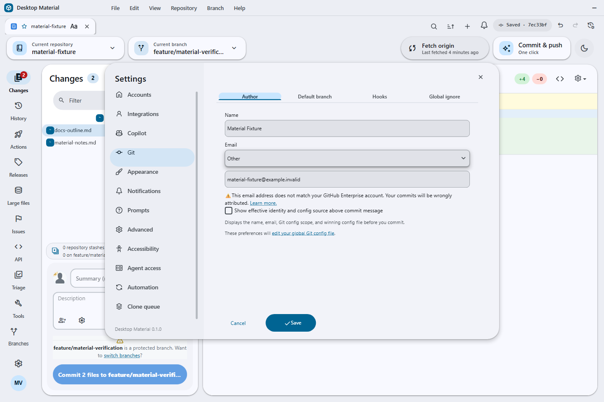

# Desktop Material

Desktop Material is an independent Material Design 3 (M3 Expressive) remake of [GitHub Desktop](https://github.com/desktop/desktop). It rebuilds the entire application shell around Material Design 3 while keeping GitHub Desktop's full Git workflow and the same underlying stack: [TypeScript](https://www.typescriptlang.org), [React](https://react.dev), [Electron](https://www.electronjs.org), and [Sass](https://sass-lang.com). This project is in active development.


## Shipped today

The complete M0–M19 roadmap is shipped on `main`. The compact status summary is
below; the implementation ledger is in [`PLAN.md`](PLAN.md), and detailed
acceptance receipts are in [`HANDOFF.md`](HANDOFF.md).

**Material Design 3 Expressive shell**
- App-bar branding with an inline pill menu
- Left icon navigation rail — Changes (with a badge), History, Branches, Settings, and the account avatar
- A floating pill toolbar with repository and branch chips and a sync pill that shows an ahead badge
- Floating, radius-24 elevated workspace cards with an animated light/dark theme
- Full MD3 workspace surfaces: tri-state selection checkboxes, tonal status chips, token-based diff colors, an inverse-surface undo banner, and a redesigned welcome flow and blank slate

**Repository tabs**
- Browser-like repository tabs, per-account and bound to repos, with inline rename
- Per-tab title styling: bold/italic/underline, size, color, font family, alignment

**Multi-account**
- Multiple accounts including multiple identities per host; per-account tabs, repos, and settings
- Browse complete GitHub organization repository lists, filter cloning by organization, and choose an organization when publishing
- Add GitLab accounts, including self-hosted endpoints, with a personal access token; add Bitbucket accounts with an app password, then browse and clone their repositories from the provider tab
- Select all repositories with a mixed-state checkbox, or opt in to automatically clone newly discovered repositories while the clone dialog remains open
- Clone a private repository from a generic HTTPS URL without a credential prompt when an eligible signed-in account matches the exact origin. Only authentication or repository-not-found ambiguity can try another exact-origin account; the successful account affinity is retained, while tokenless or stale tokenless bindings are skipped and missing, SSH, non-authentication, and cross-origin credentials never widen fallback
- The repository list can hide its automatically maintained Recent group from **Settings → Appearance**
- Repositories can be pinned from their context menu into a dedicated top group

**Versioned settings & history**
- Per-account settings stored in a local git repo — every settings/tabs change auto-commits. Open **Edit → Settings History…** (`Ctrl+Alt+Z`) for a non-modal timeline with lazy diffs, undo, redo, and restore; each history action adds an audit commit instead of rewriting history

**Non-modal dialog framework**
- Dialogs float without blocking the app, drag by their headers, cascade, and can be brought to front — the app stays fully interactive behind an open dialog
- Preferences rebuilt as an MD3 940×660 dialog with a left rail, an Active chip, and a pill footer
- Repository and branch pickers are MD3 side sheets; the clone dialog is restyled to match

**Notification centre**
- A bell and right-hand side sheet backed by its own local git repo — unread badges, mark read/unread, delete, mark-all, and a git-backed history you can undo/restore
- Switch to a separate live GitHub inbox for any signed-in GitHub.com or Enterprise account, filter unread/all and participating threads, load bounded pages, open only validated provider links, mark read, and confirm mark-done without copying remote threads into the local log

**Search everywhere, with a regex builder**
- Every search bar gains fuzzy / substring / regex filter modes, a case toggle, and per-list filter chips
- A full regex builder — anchors, character classes, quantifiers, groups, alternation, lookaround, all six flags, and a live tester — reachable from the search bars

**Repository safety and cleanup**
- A context-menu option can permanently discard changes without sending files to the trash, including untracked files, for large cleanup operations where the regular discard flow would be slow
- Local-only branches use a clear publish indicator, including branches whose configured upstream was deleted
- Branch lists can be sorted by last activity or alphabetically from **Settings → Appearance**
- The commit composer can show the effective Git author name/email plus the winning config scope and file before commit
- Merge commits use a distinct, subdued italic summary in History so integration points are easy to scan

**Dynamic UI scaling**
- A UI-scale slider (50–200%) in Preferences → Appearance plus auto-fit-to-window that shrinks the interface to fit smaller windows (on by default), composing with `Ctrl` `+` / `-` / `0`
- At the supported minimum window size, a requested 200% scale safely auto-fits below the requested maximum, keeping the title bar, navigation, Appearance controls, and footer visible without horizontal clipping; the latest P0 gate measured 94%, while the earlier screenshot below records a 96% viewport

**Per-repo `.gitignore` manager**
- Open **Repository → Manage .gitignore…** for a manager that auto-suggests templates from your repo's contents, a searchable catalog of ~19 templates grouped by category, one-click apply/remove, and a raw editor — all merged into marked, reversible sections

**One-click Build & Run**
- Auto-detects bounded, nested project roots and runnable profiles for Node/npm/yarn/pnpm/bun, Deno, Rust, Go, .NET, Python, Java/Kotlin, PHP, Ruby, Swift, Dart/Flutter, Elixir, Scala, Haskell, Zig, Make, and CMake; each choice shows its project folder so similarly named profiles are unambiguous
- Installs dependencies, builds, and runs the selected profile in one action, streaming output to an MD3 log panel with responsive wrapping and no clipped project names
- Auto-ignores build outputs (applies the matching `.gitignore` template + an artifacts section) before building
- Bounded auto-fix on failure, a per-repo Build & Run settings tab, bounded discovery of nested projects, and optional single-prompt UAC pre-elevation

**Automation and GitHub Actions**
- Configure scheduled commit-and-push and pull globally, override them per account or repository, and rely on safety guards that skip unsafe repositories and preserve draft commit messages
- Run commit-and-push immediately, or merge all branches/worktrees with per-target progress and Copilot-assisted conflict handling
- Browse GitHub Actions runs in the repository rail, filter by workflow/branch/event/status, re-run all or failed jobs, inspect jobs and steps, securely download and search logs, and dispatch workflows with inputs

**Agent access and command line**
- Enable an opt-in, token-gated local agent server from **Settings → Agent access**; it exposes MCP and REST on a random loopback-only port and never returns account credentials
- Use the bundled stdio proxy or command-line client to list accounts/repos/tabs, inspect status, clone, commit, fetch/pull/push, manage branches/tabs, run automation, and dispatch workflows

**Power-user history, stashes, and windows**
- Search History by title, message, tag, or hash and toggle a lane graph that visualizes commit ancestry
- Use the repository-wide Stash Manager to create, inspect, apply, pop, rename, branch from, or delete an exact stash while retaining partial-failure context
- Pull every repository from the repositories sheet with per-repository results; an ambiguous HTTPS authentication or not-found response can retry every remaining token-bearing signed-in account for that exact origin without displaying an identity or token
- Deepen or unshallow a repository from History/Repository Tools with the same exact-origin Desktop credential trampoline and bounded signed-in-account recovery when the default credential is rejected
- Use repository pinning/grouping, branch presets/default-branch controls, and per-repository editor overrides
- Add, lock, move, rename, repair, remove, or prune worktrees, and open repositories or worktrees in separate windows with isolated per-window selection and persisted tabs

**Guided Git and provider administration**
- Exchange reviewed patch series, rewrite local commits from an explicit plan, configure commit/tag signing, administer Git LFS, and run bounded guided bisect sessions from named Repository Tools panels
- Manage every named remote with guarded add/rename/update/default/remove operations, and inspect or create exact known client hooks through the effective `core.hooksPath` without displaying hook contents or absolute paths
- Pin, hide, solo, and restore branch visibility; preview exact merge-tree conflict paths before a merge changes the worktree
- Triage bounded Issue and pull-request summaries for the exact selected GitHub, GitLab, or Bitbucket account/repository, including explicit provider-unavailable, unsupported, partial, and capped states

**Guided GitHub workflows**
- Compose pull requests with repository templates and metadata, then inspect, update, review, close/reopen, or merge the exact reviewed pull request through a fail-closed lifecycle
- Browse paginated Actions artifacts, download with bounded redirect and digest checks, and inspect the effective rules that apply to the current branch
- Browse and manage GitHub Releases and assets with bounded transfers; browse, search, filter, inspect, edit, comment on, close, or reopen Issues through repository/account-bound review state

**Fully Material, everywhere**
- The remaining stock surfaces — tooltips, menus, banners, autocomplete popups, segmented controls, split-buttons, dialog internals, History/CI surfaces — are re-tinted through the Material token system in both light and dark themes

**Also shipped:** multi-clone with organization chips, parallel/sequential modes and URL-only import/export; one-click commit and push with a generated message; self-update checks against Desktop Material releases; SVG diff hardening and display controls; safer undo/reset/tag deletion confirmations; and responsive, keyboard-accessible MD3 surfaces throughout the app.

## Roadmap

The complete M0–M19 status, current maintenance work, and acceptance rules now
live in [`ROADMAP.md`](ROADMAP.md). Detailed implementation and verification
receipts remain in [`PLAN.md`](PLAN.md) and [`HANDOFF.md`](HANDOFF.md).

## Screenshots

The compact selection below keeps this README scannable. The
[guided feature gallery](docs/wiki/Feature-Gallery.md) and
[task-oriented tutorial](docs/wiki/User-Guide.md) contain the full annotated
set.

| Repository workflows | GitHub workflows | Accessibility and shell |
| --- | --- | --- |
| <br><sub>Repository Tools</sub> | <br><sub>Actions caches</sub> | <br><sub>200% auto-fit</sub> |
| <br><sub>Pull All</sub> | <br><sub>Pull requests</sub> | <br><sub>Material workspace</sub> |
| <br><sub>Stash manager</sub> | <br><sub>Issues</sub> | <br><sub>Responsive clipping gate</sub> |

<details>
<summary><strong>Open 30 more verified screenshots</strong></summary>

| Clone and checkout | Repository administration | Accounts and automation |
| --- | --- | --- |
| <br><sub>Account-aware clone</sub> | <br><sub>Remote manager</sub> | <br><sub>Provider accounts</sub> |
| <br><sub>Shallow clone</sub> | <br><sub>Gitignore manager</sub> | <br><sub>Automation</sub> |
| <br><sub>Sparse checkout</sub> | <br><sub>History deepening</sub> | <br><sub>Agent access</sub> |
| <br><sub>Branches</sub> | <br><sub>Repositories</sub> | <br><sub>Multi-window</sub> |
| <br><sub>History search</sub> | <br><sub>Merge All</sub> | <br><sub>Notifications</sub> |
| <br><sub>Regex builder</sub> | <br><sub>Settings history</sub> | <br><sub>Settings</sub> |

| Pull requests and rules | Actions | Releases, issues, and providers |
| --- | --- | --- |
| <br><sub>Create pull request</sub> | <br><sub>Job log</sub> | <br><sub>Releases</sub> |
| <br><sub>Branch rules</sub> | <br><sub>Artifact download</sub> | <br><sub>Provider triage</sub> |
| <br><sub>Deployment review</sub> | <br><sub>Run pagination</sub> | <br><sub>GitHub notifications</sub> |
| <br><sub>Attempt-aware jobs</sub> | <br><sub>Artifact pagination</sub> | <br><sub>Artifact provenance</sub> |

</details>

## Building

Full instructions live in [`docs/contributing/setup.md`](docs/contributing/setup.md). In short, with Node 24.15.0:

```
yarn && yarn build:dev && yarn start
```

## Project site & docs

- Project site: https://codingmachineedge.github.io/desktop-material/
- Wiki: https://github.com/codingmachineedge/desktop-material/wiki

## Credits & License

Desktop Material is built on [GitHub Desktop](https://github.com/desktop/desktop) (MIT), with feature-parity references from [desktop-plus](https://github.com/say25/desktop-plus) (MIT). Thanks to both projects and their contributors.

**[MIT](LICENSE)**

The MIT license grant is not for GitHub's trademarks, which include the logo designs. GitHub reserves all trademark and copyright rights in and to all GitHub trademarks. GitHub's logos include, for instance, the stylized Invertocat designs that include "logo" in the file title in the following folder: [logos](app/static/logos).

GitHub® and its stylized versions and the Invertocat mark are GitHub's Trademarks or registered Trademarks. When using GitHub's logos, be sure to follow the GitHub [logo guidelines](https://github.com/logos).
