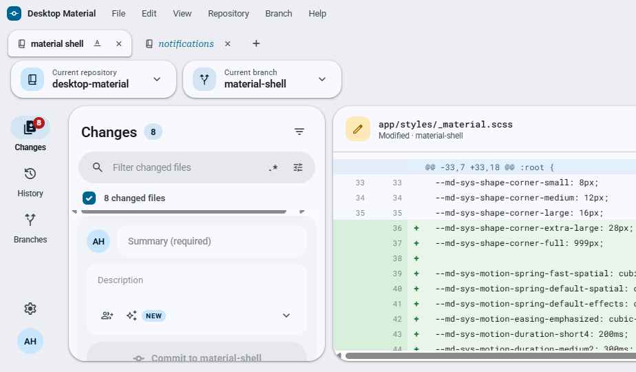
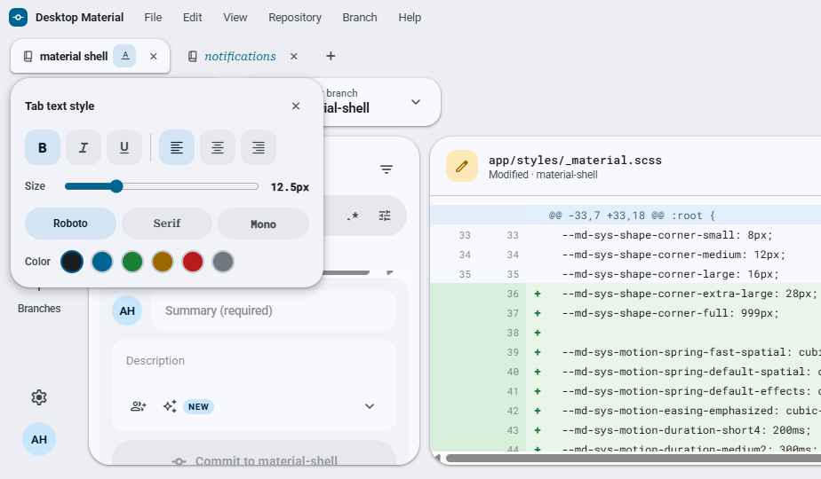
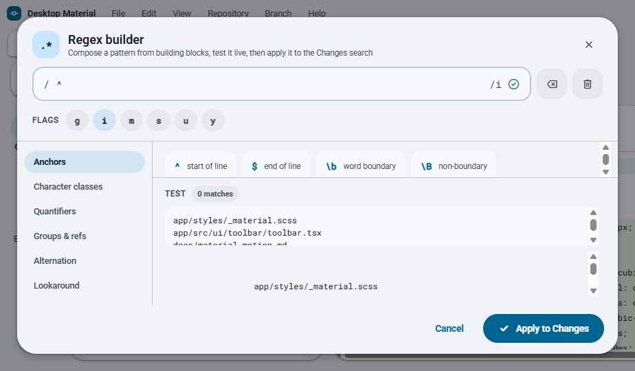
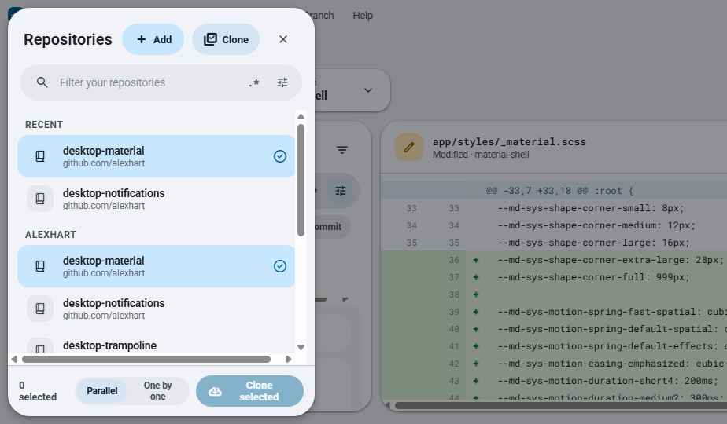
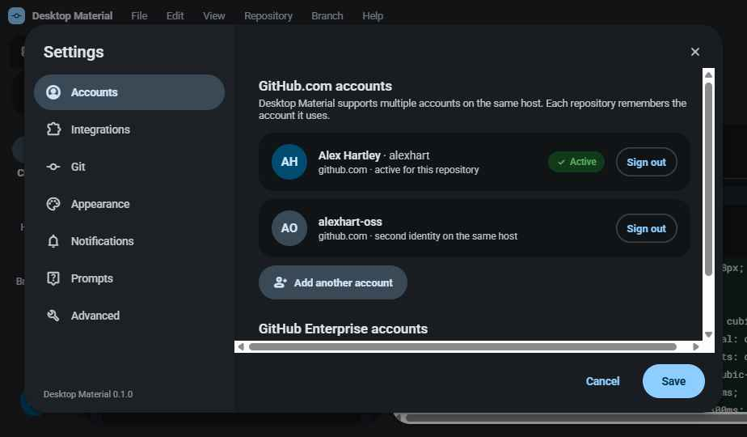

# Desktop Material

Desktop Material is an independent Material Design 3 (M3 Expressive) remake of [GitHub Desktop](https://github.com/desktop/desktop). It rebuilds the entire application shell around Material Design 3 while keeping GitHub Desktop's full Git workflow and the same underlying stack: [TypeScript](https://www.typescriptlang.org), [React](https://react.dev), [Electron](https://www.electronjs.org), and [Sass](https://sass-lang.com). This project is in active development.

<picture>
  <source
    srcset="docs/assets/screenshots/workspace-dark.png"
    media="(prefers-color-scheme: dark)"
  />
  
</picture>


## Features

On top of GitHub Desktop's complete Git workflow, Desktop Material adds:

**Shell & theming**
- Material Design 3 Expressive shell with animated light/dark theme
- Dynamic UI scaling: 50–200% slider plus auto-fit to window
- Non-modal dialogs that float without blocking the app and drag by their headers

**Tabs & accounts**
- Browser-like repository tabs, per-account and bound to repos, with inline rename
- Per-tab title styling: bold/italic/underline, size, color, font family, alignment
- Multiple accounts including multiple identities per host; per-account tabs, repos, and settings
- Per-account settings stored in a local git repo — every settings/tabs change auto-commits, with a full undo history manager (undo/redo/restore to any commit)

**Cloning & organizations**
- Multi-clone: select many repos with checkboxes, org filter chips, parallel or one-by-one cloning
- Export/import repo lists (URLs only)
- GitHub organization support: browse and clone full org repo lists, and publish into an org

**Search**
- Search upgrades on every search bar: filter chips, a regex mode toggle, and a full regex builder (anchors, classes, quantifiers, groups, alternation, lookaround, all six flags, live tester)

**Automation & AI**
- One-click commit & push, with Copilot writing the message
- Scheduled auto commit & push and auto pull (global default plus per-repo override)
- Merge-all branches/worktrees into the default branch with Copilot conflict resolution, then delete merged branches and push
- Built-in MCP server (plus a local HTTP/CLI fallback) for AI agent control

**Actions & notifications**
- GitHub Actions panel: workflow runs, status/branch/event filters, re-run / re-run-failed, job steps, in-app log viewer, and a workflow_dispatch dialog
- Notification centre: bell plus side panel backed by its own local git repo, with unread badge and mark read/unread/delete

**Integrations & parity**
- Self-hosted GitLab sign-in (endpoint plus personal access token), and GitLab/Bitbucket integration
- Desktop-plus parity: commit search, commit graph, multiple stashes, repo pinning/grouping, pull-all, and more

## Screenshots

| | |
|---|---|
|  |  |
| **Per-tab title styling** — bold, italic, size, color, and font per tab | **Regex builder** — anchors, classes, quantifiers, flags, and a live tester |
|  |  |
| **Settings history manager** — undo/redo and restore to any commit | **Multi-clone** — checkboxes, org filter chips, parallel cloning |
|  | |
| **Multi-account settings** — multiple identities per host and self-hosted GitLab sign-in | |

## Building

Full instructions live in [`docs/contributing/setup.md`](docs/contributing/setup.md). In short, with Node 24.15.0:

```
yarn && yarn build:dev && yarn start
```

## Project site & docs

- Project site: https://codingmachineedge.github.io/desktop-material/
- Wiki: https://github.com/codingmachineedge/desktop-material/wiki

## Credits & License

Desktop Material is built on [GitHub Desktop](https://github.com/desktop/desktop) (MIT), with feature-parity references from [desktop-plus](https://github.com/say25/desktop-plus) (MIT). Thanks to both projects and their contributors.

**[MIT](LICENSE)**

The MIT license grant is not for GitHub's trademarks, which include the logo designs. GitHub reserves all trademark and copyright rights in and to all GitHub trademarks. GitHub's logos include, for instance, the stylized Invertocat designs that include "logo" in the file title in the following folder: [logos](app/static/logos).

GitHub® and its stylized versions and the Invertocat mark are GitHub's Trademarks or registered Trademarks. When using GitHub's logos, be sure to follow the GitHub [logo guidelines](https://github.com/logos).
