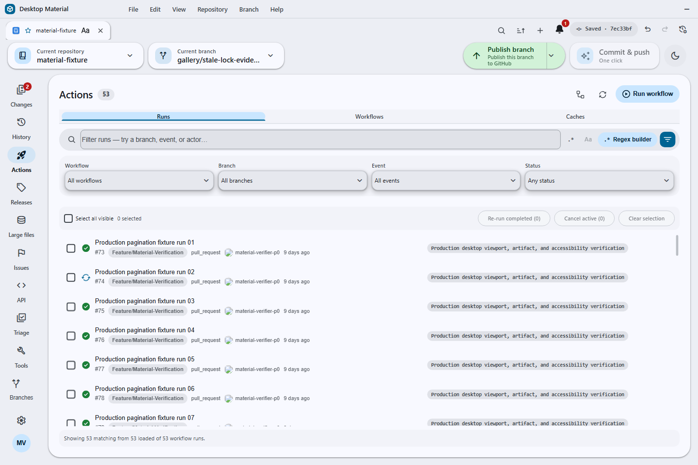
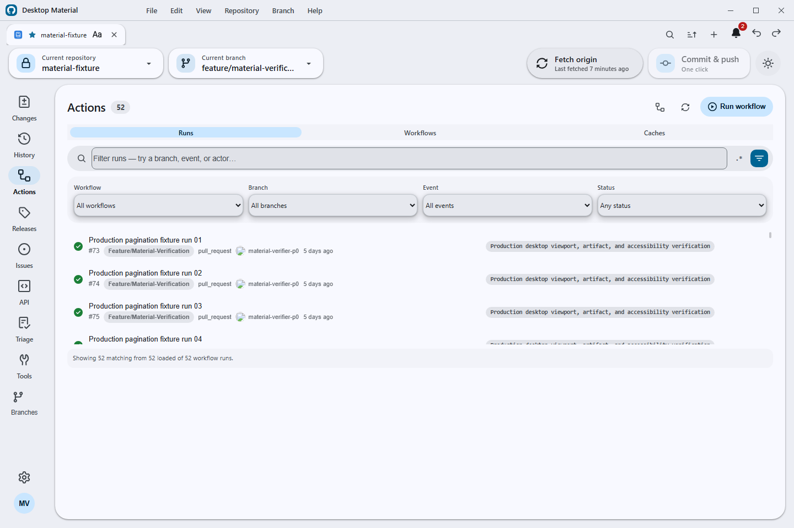

# Desktop Material

Desktop Material is an independent Material Design 3 (M3 Expressive) remake of [GitHub Desktop](https://github.com/desktop/desktop). It rebuilds the entire application shell around Material Design 3 while keeping GitHub Desktop's full Git workflow and the same underlying stack: [TypeScript](https://www.typescriptlang.org), [React](https://react.dev), [Electron](https://www.electronjs.org), and [Sass](https://sass-lang.com). This project is in active development.


## Shipped today

The complete M0–M19 roadmap is live on `main`. Exact app source
`5e80e678d062b65a82c0991b352e5a861c7469e5` passed the reproducible production
build and isolated hidden-desktop interaction gate. Documentation and the exact
14-image acceptance set were published in `main` union
`a890ab579c63651e5089ee433b259f0fc9198fbf`; final code/release baseline
`a0c2f19433631d577979c8c8a88a5151f5ab0656` passed all seven jobs in
[CI 29274841990](https://github.com/codingmachineedge/desktop-material/actions/runs/29274841990)
and published the verified public
[b0000000083 release](https://github.com/codingmachineedge/desktop-material/releases/tag/v3.6.3-beta3-b0000000083).
The corresponding Pages deployment, canonical wiki, screenshot hashes,
privacy scan, artifact purge, and owned-resource cleanup are complete.

**Material Design 3 Expressive shell**
- App-bar branding with an inline pill menu
- Left icon navigation rail — Changes (with a badge), History, Branches, Settings, and the account avatar
- A floating pill toolbar with repository and branch chips and a sync pill that shows an ahead badge
- Floating, radius-24 elevated workspace cards with an animated light/dark theme
- Full MD3 workspace surfaces: tri-state selection checkboxes, tonal status chips, token-based diff colors, an inverse-surface undo banner, and a redesigned welcome flow and blank slate

**Repository tabs**
- Browser-like repository tabs, per-account and bound to repos, with inline rename
- Per-tab title styling: bold/italic/underline, size, color, font family, alignment

**Multi-account**
- Multiple accounts including multiple identities per host; per-account tabs, repos, and settings
- Browse complete GitHub organization repository lists, filter cloning by organization, and choose an organization when publishing
- Add GitLab accounts, including self-hosted endpoints, with a personal access token; add Bitbucket accounts with an app password, then browse and clone their repositories from the provider tab
- Clone a private repository from a generic HTTPS URL without a credential prompt when an eligible signed-in account matches the exact origin. Only authentication or repository-not-found ambiguity can try another exact-origin account; the successful account affinity is retained, while tokenless or stale tokenless bindings are skipped and missing, SSH, non-authentication, and cross-origin credentials never widen fallback
- The repository list can hide its automatically maintained Recent group from **Settings → Appearance**
- Repositories can be pinned from their context menu into a dedicated top group

**Versioned settings & history**
- Per-account settings stored in a local git repo — every settings/tabs change auto-commits. Open **Edit → Settings History…** (`Ctrl+Alt+Z`) for a non-modal timeline with lazy diffs, undo, redo, and restore; each history action adds an audit commit instead of rewriting history

**Non-modal dialog framework**
- Dialogs float without blocking the app, drag by their headers, cascade, and can be brought to front — the app stays fully interactive behind an open dialog
- Preferences rebuilt as an MD3 940×660 dialog with a left rail, an Active chip, and a pill footer
- Repository and branch pickers are MD3 side sheets; the clone dialog is restyled to match

**Notification centre**
- A bell and right-hand side sheet backed by its own local git repo — unread badges, mark read/unread, delete, mark-all, and a git-backed history you can undo/restore
- Switch to a separate live GitHub inbox for any signed-in GitHub.com or Enterprise account, filter unread/all and participating threads, load bounded pages, open only validated provider links, mark read, and confirm mark-done without copying remote threads into the local log

**Search everywhere, with a regex builder**
- Every search bar gains fuzzy / substring / regex filter modes, a case toggle, and per-list filter chips
- A full regex builder — anchors, character classes, quantifiers, groups, alternation, lookaround, all six flags, and a live tester — reachable from the search bars

**Repository safety and cleanup**
- A context-menu option can permanently discard changes without sending files to the trash, including untracked files, for large cleanup operations where the regular discard flow would be slow
- Local-only branches use a clear publish indicator, including branches whose configured upstream was deleted
- Branch lists can be sorted by last activity or alphabetically from **Settings → Appearance**
- The commit composer can show the effective Git author name/email plus the winning config scope and file before commit
- Merge commits use a distinct, subdued italic summary in History so integration points are easy to scan

**Dynamic UI scaling**
- A UI-scale slider (50–200%) in Preferences → Appearance plus auto-fit-to-window that shrinks the interface to fit smaller windows (on by default), composing with `Ctrl` `+` / `-` / `0`
- At the supported minimum window size, a requested 200% scale safely auto-fits below the requested maximum, keeping the title bar, navigation, Appearance controls, and footer visible without horizontal clipping; the latest P0 gate measured 94%, while the earlier screenshot below records a 96% viewport

**Per-repo `.gitignore` manager**
- Open **Repository → Manage .gitignore…** for a manager that auto-suggests templates from your repo's contents, a searchable catalog of ~19 templates grouped by category, one-click apply/remove, and a raw editor — all merged into marked, reversible sections

**One-click Build & Run**
- Detects the project's build profile (Node/pnpm/yarn, Rust, Go, .NET, Python, Java, Make/CMake), then installs dependencies, builds, and runs it in one action, streaming output to an MD3 log panel
- Auto-ignores build outputs (applies the matching `.gitignore` template + an artifacts section) before building
- Bounded auto-fix on failure, a per-repo Build & Run settings tab, and optional single-prompt UAC pre-elevation

**Automation and GitHub Actions**
- Configure scheduled commit-and-push and pull globally, override them per account or repository, and rely on safety guards that skip unsafe repositories and preserve draft commit messages
- Run commit-and-push immediately, or merge all branches/worktrees with per-target progress and Copilot-assisted conflict handling
- Browse GitHub Actions runs in the repository rail, filter by workflow/branch/event/status, re-run all or failed jobs, inspect jobs and steps, securely download and search logs, and dispatch workflows with inputs

**Agent access and command line**
- Enable an opt-in, token-gated local agent server from **Settings → Agent access**; it exposes MCP and REST on a random loopback-only port and never returns account credentials
- Use the bundled stdio proxy or command-line client to list accounts/repos/tabs, inspect status, clone, commit, fetch/pull/push, manage branches/tabs, run automation, and dispatch workflows

**Power-user history, stashes, and windows**
- Search History by title, message, tag, or hash and toggle a lane graph that visualizes commit ancestry
- Use the repository-wide Stash Manager to create, inspect, apply, pop, rename, branch from, or delete an exact stash while retaining partial-failure context
- Pull every repository from the repositories sheet with per-repository results; an ambiguous HTTPS authentication or not-found response can retry every remaining token-bearing signed-in account for that exact origin without displaying an identity or token
- Deepen or unshallow a repository from History/Repository Tools with the same exact-origin Desktop credential trampoline and bounded signed-in-account recovery when the default credential is rejected
- Use repository pinning/grouping, branch presets/default-branch controls, and per-repository editor overrides
- Add, lock, move, rename, repair, remove, or prune worktrees, and open repositories or worktrees in separate windows with isolated per-window selection and persisted tabs

**Guided Git and provider administration**
- Exchange reviewed patch series, rewrite local commits from an explicit plan, configure commit/tag signing, administer Git LFS, and run bounded guided bisect sessions from named Repository Tools panels
- Manage every named remote with guarded add/rename/update/default/remove operations, and inspect or create exact known client hooks through the effective `core.hooksPath` without displaying hook contents or absolute paths
- Pin, hide, solo, and restore branch visibility; preview exact merge-tree conflict paths before a merge changes the worktree
- Triage bounded Issue and pull-request summaries for the exact selected GitHub, GitLab, or Bitbucket account/repository, including explicit provider-unavailable, unsupported, partial, and capped states

**Guided GitHub workflows**
- Compose pull requests with repository templates and metadata, then inspect, update, review, close/reopen, or merge the exact reviewed pull request through a fail-closed lifecycle
- Browse paginated Actions artifacts, download with bounded redirect and digest checks, and inspect the effective rules that apply to the current branch
- Browse and manage GitHub Releases and assets with bounded transfers; browse, search, filter, inspect, edit, comment on, close, or reopen Issues through repository/account-bound review state

**Fully Material, everywhere**
- The remaining stock surfaces — tooltips, menus, banners, autocomplete popups, segmented controls, split-buttons, dialog internals, History/CI surfaces — are re-tinted through the Material token system in both light and dark themes

**Also shipped:** multi-clone with organization chips, parallel/sequential modes and URL-only import/export; one-click commit and push with a generated message; self-update checks against Desktop Material releases; SVG diff hardening and display controls; safer undo/reset/tag deletion confirmations; and responsive, keyboard-accessible MD3 surfaces throughout the app.

## Roadmaps

This is a compact status map; detailed receipts stay in the linked run manifests and [`HANDOFF.md`](HANDOFF.md). A roadmap item is **Done** only after implementation, focused checks, an exact low-level MCP/headless-desktop gate for UI work, inspected screenshots, documentation updates, and a push to `main`.

Last updated: **July 14, 2026**.

| State | Wave | Current proof or next gate |
|---|---|---|
| **Done** | M0–M19 guided Git, GitHub, provider parity, and Material shell | Implementation ledger and closing acceptance are recorded in [`PLAN.md`](PLAN.md); prior P0, pagination, and run-inspector receipts remain in `.codex/run-manifests/`. |
| **Done** | Actions provenance foundation and selected-account orchestration | Fixed policy, exact run-attempt binding, safe ZIP subject inventory, opaque IPC, verifier runtime, credential lease, and renderer/store review lifecycle are shipped. The compact implementation receipt is [`2026-07-14-actions-artifact-provenance-result-ui.md`](.codex/run-manifests/2026-07-14-actions-artifact-provenance-result-ui.md). |
| **Done** | Actions provenance review/result UI and Actions cache manager | The cache manager loads through the selected repository account, preserves cache state across run refreshes, exposes bounded usage/list/delete workflows, and has headless geometry evidence in the current screenshot set. |
| **Done** | Pull Request Center, Release Manager, and Issue Hub | M19’s bounded PR lifecycle/read-review, Releases/assets, and richer Issues surfaces are implemented, tested, documented, and represented in the accepted screenshot gallery. |
| **Done** | Remaining named Git functions | Patch-series exchange, structured commit rewriting, signing, LFS, worktree/remote/stash administration, reflog recovery, merge-tree conflict preview, and guided bisect are recorded as complete in [`PLAN.md`](PLAN.md). |

#### Current delivery rule

Each UI slice gets a focused test receipt, a low-level MCP/headless-desktop capture set, and privacy-safe screenshots in [`docs/assets/screenshots/`](docs/assets/screenshots/). The same captures are referenced from README, the wiki gallery/user guide, and the Pages gallery before the slice is pushed to `main`. The full provenance contract and adversarial test inventory remain in the [provenance manifest](.codex/run-manifests/2026-07-14-actions-artifact-provenance-result-ui.md), rather than being duplicated here.

### Capability map

| Area | Shipped proof |
|---|---|---|
| **Git** | Core repository, history, branch, commit, stash, remote, worktree, merge/rebase, fetch/pull/push, automation, Repository Tools, patch series, structured rewrite, signing, LFS, shallow-history recovery, sparse checkout, archives, bundles, merge-tree preview, bisect, reflog, and recovery workflows. |
| **GitHub** | Account-bound Issues/PRs, Releases/assets, Notifications, Actions runs/artifacts/jobs/logs/reviews, artifact provenance review, cache inventory/deletion, branch rules, clone/fork/publish, organization browsing, repository administration, and provider-neutral triage. |
| **Material shell** | Responsive M3 surfaces, themes, scaling, keyboard focus, multi-window routing, repository tabs, search, automation, non-modal dialogs, and the current screenshot/documentation evidence gate. |
| **Reference** | GitKraken comparisons remain internal planning evidence; proprietary cloud, enterprise, AI, and collaboration services are not copied. |

The REST/GraphQL and Git command inventories are audit inputs only. Users get named workflows, never a raw command, endpoint, or GraphQL editor.

### Verification roadmap

- Do not require sideways scrolling in page or dialog shells wherever responsive wrapping or stacking can preserve usability. Horizontal scrolling is reserved for intrinsically spatial code, diff, and log surfaces.
- Verify desktop and minimum supported windows, 50–200% UI scaling, light/dark themes, long repository/branch/host names, destructive confirmations, keyboard focus, and screen-reader labels.
- Commit and push each coherent milestone. Documentation and screenshots must name the exact verified commit and must never claim an unbuilt state was exercised.

## Screenshots

### P0 named Git and GitHub functions


**History deepening** — the guided function reports a complete repository after the deterministic shallow fixture expanded from 3 to 15 commits.


**Create pull request** — purpose-built base/head, title, description, draft, review, and submit states; no command or API editor.


**Actions artifacts** — bounded run artifact browsing, native save, local SHA-256 comparison, reveal, and explicit presence-only attestation language.


**Actions cache manager** — the selected-account repository view reports 3 caches using 836.8 MiB, wraps long keys and refs, and keeps single-cache and delete-by-key actions visible without horizontal scrolling.







**Actions run pagination** — provider-side filters and a named load-more control retain 51 successful runs across Refresh without a command or endpoint editor.


**Actions artifact pagination** — 31 artifacts load in two bounded pages; the page-two long name wraps without overlap, clipping, or sideways page scrolling.


**Actions job pagination** — the current or a historical attempt loads through bounded 50-job pages; the retained 503→200 retry keeps page one and exact job log/re-run actions without widening the page.


**Pending deployments** — purpose-built environment selection, review history, bounded approve/reject comments, locked-state guidance, and separate fork approval remain inside a vertically scrollable run-detail surface.


**Effective branch rules** — account-aware protection and ruleset state with long checks and deployments wrapped inside a vertically scrollable sheet.

### Post-merge production launch


**Production launch** — the rebuilt `b6e78eecf3` source opens to the privacy-safe welcome surface in the isolated off-screen verification profile; the original 960×660 capture was inspected before promotion.

### Additional Material workflows


**Automation** — guarded commit/push and pull schedules with layered overrides.


**Notifications** — unread state, history, restore, and cleanup.


**History power tools** — commit search, filters, and ancestry graph.


**Merge all** — branches/worktrees with per-target progress.


**Agent access** — opt-in loopback MCP/REST with bearer-token controls.


**Provider accounts** — GitHub, GitLab, Bitbucket, and self-hosted endpoints.


**Multi-window** — isolated repository/worktree windows and persisted tabs.


**Settings history** — Git-backed timeline, diff, Undo, Redo, restore-to-point.


**200% auto-fit** — minimum-window dark-theme verification with no clipped controls.


**Workspace shell** — Material navigation, toolbar, cards, and commit flow.

## Building

Full instructions live in [`docs/contributing/setup.md`](docs/contributing/setup.md). In short, with Node 24.15.0:

```
yarn && yarn build:dev && yarn start
```

## Project site & docs

- Project site: https://codingmachineedge.github.io/desktop-material/
- Wiki: https://github.com/codingmachineedge/desktop-material/wiki

## Credits & License

Desktop Material is built on [GitHub Desktop](https://github.com/desktop/desktop) (MIT), with feature-parity references from [desktop-plus](https://github.com/say25/desktop-plus) (MIT). Thanks to both projects and their contributors.

**[MIT](LICENSE)**

The MIT license grant is not for GitHub's trademarks, which include the logo designs. GitHub reserves all trademark and copyright rights in and to all GitHub trademarks. GitHub's logos include, for instance, the stylized Invertocat designs that include "logo" in the file title in the following folder: [logos](app/static/logos).

GitHub® and its stylized versions and the Invertocat mark are GitHub's Trademarks or registered Trademarks. When using GitHub's logos, be sure to follow the GitHub [logo guidelines](https://github.com/logos).
