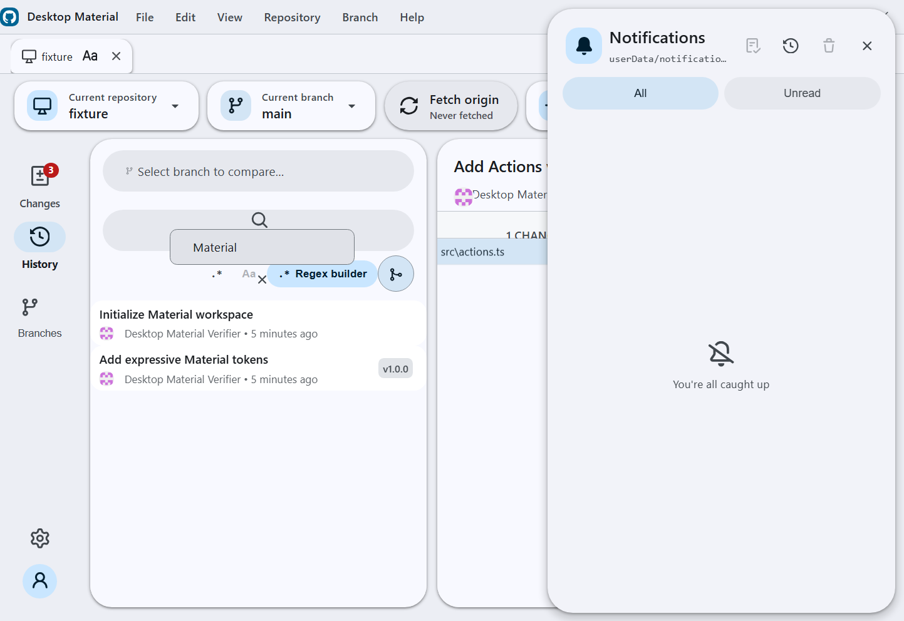
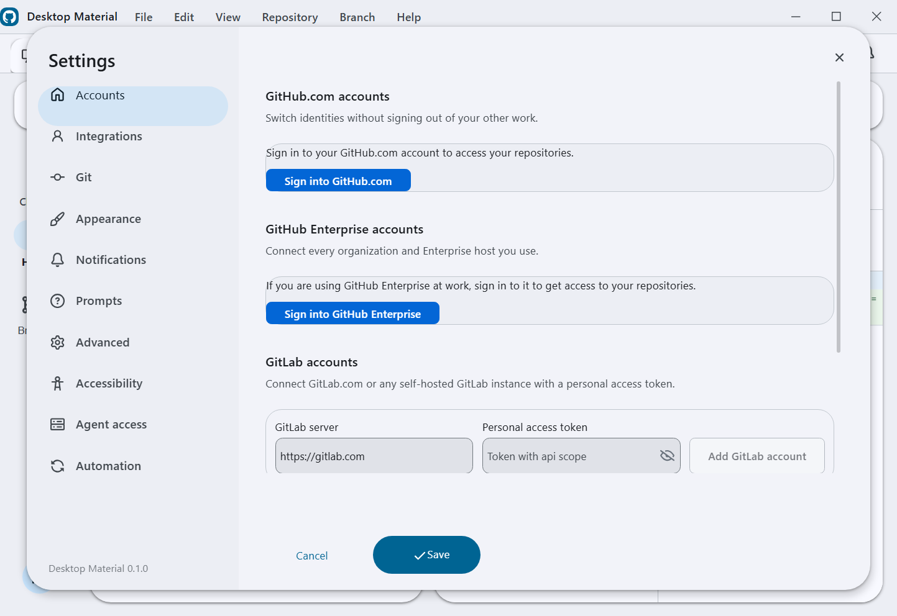

# Desktop Material

Desktop Material is an independent Material Design 3 (M3 Expressive) remake of [GitHub Desktop](https://github.com/desktop/desktop). It rebuilds the entire application shell around Material Design 3 while keeping GitHub Desktop's full Git workflow and the same underlying stack: [TypeScript](https://www.typescriptlang.org), [React](https://react.dev), [Electron](https://www.electronjs.org), and [Sass](https://sass-lang.com). This project is in active development.


## Shipped today

These features are implemented and live on `main`.

**Material Design 3 Expressive shell**
- App-bar branding with an inline pill menu
- Left icon navigation rail — Changes (with a badge), History, Branches, Settings, and the account avatar
- A floating pill toolbar with repository and branch chips and a sync pill that shows an ahead badge
- Floating, radius-24 elevated workspace cards with an animated light/dark theme
- Full MD3 workspace surfaces: tri-state selection checkboxes, tonal status chips, token-based diff colors, an inverse-surface undo banner, and a redesigned welcome flow and blank slate

**Repository tabs**
- Browser-like repository tabs, per-account and bound to repos, with inline rename
- Per-tab title styling: bold/italic/underline, size, color, font family, alignment

**Multi-account**
- Multiple accounts including multiple identities per host; per-account tabs, repos, and settings
- Browse complete GitHub organization repository lists, filter cloning by organization, and choose an organization when publishing
- Add GitLab accounts, including self-hosted endpoints, with a personal access token; add Bitbucket accounts with an app password, then browse and clone their repositories from the provider tab
- The repository list can hide its automatically maintained Recent group from **Settings → Appearance**
- Repositories can be pinned from their context menu into a dedicated top group

**Versioned settings & history**
- Per-account settings stored in a local git repo — every settings/tabs change auto-commits. Open **Edit → Settings History…** (`Ctrl+Alt+Z`) for a non-modal timeline with lazy diffs, undo, redo, and restore; each history action adds an audit commit instead of rewriting history

**Non-modal dialog framework**
- Dialogs float without blocking the app, drag by their headers, cascade, and can be brought to front — the app stays fully interactive behind an open dialog
- Preferences rebuilt as an MD3 940×660 dialog with a left rail, an Active chip, and a pill footer
- Repository and branch pickers are MD3 side sheets; the clone dialog is restyled to match

**Notification centre**
- A bell and right-hand side sheet backed by its own local git repo — unread badges, mark read/unread, delete, mark-all, and a git-backed history you can undo/restore

**Search everywhere, with a regex builder**
- Every search bar gains fuzzy / substring / regex filter modes, a case toggle, and per-list filter chips
- A full regex builder — anchors, character classes, quantifiers, groups, alternation, lookaround, all six flags, and a live tester — reachable from the search bars

**Repository safety and cleanup**
- A context-menu option can permanently discard changes without sending files to the trash, including untracked files, for large cleanup operations where the regular discard flow would be slow
- Local-only branches use a clear publish indicator, including branches whose configured upstream was deleted
- Branch lists can be sorted by last activity or alphabetically from **Settings → Appearance**
- The commit composer can show the effective Git author name/email plus the winning config scope and file before commit
- Merge commits use a distinct, subdued italic summary in History so integration points are easy to scan

**Dynamic UI scaling**
- A UI-scale slider (50–200%) in Preferences → Appearance plus auto-fit-to-window that shrinks the interface to fit smaller windows (on by default), composing with `Ctrl` `+` / `-` / `0`
- At the supported minimum window size, a requested 200% scale safely auto-fits to 96%, keeping the title bar, navigation, Appearance controls, and footer visible without horizontal clipping

**Per-repo `.gitignore` manager**
- Open **Repository → Manage .gitignore…** for a manager that auto-suggests templates from your repo's contents, a searchable catalog of ~19 templates grouped by category, one-click apply/remove, and a raw editor — all merged into marked, reversible sections

**One-click Build & Run**
- Detects the project's build profile (Node/pnpm/yarn, Rust, Go, .NET, Python, Java, Make/CMake), then installs dependencies, builds, and runs it in one action, streaming output to an MD3 log panel
- Auto-ignores build outputs (applies the matching `.gitignore` template + an artifacts section) before building
- Bounded auto-fix on failure, a per-repo Build & Run settings tab, and optional single-prompt UAC pre-elevation

**Automation and GitHub Actions**
- Configure scheduled commit-and-push and pull globally, override them per account or repository, and rely on safety guards that skip unsafe repositories and preserve draft commit messages
- Run commit-and-push immediately, or merge all branches/worktrees with per-target progress and Copilot-assisted conflict handling
- Browse GitHub Actions runs in the repository rail, filter by workflow/branch/event/status, re-run all or failed jobs, inspect jobs and steps, securely download and search logs, and dispatch workflows with inputs

**Agent access and command line**
- Enable an opt-in, token-gated local agent server from **Settings → Agent access**; it exposes MCP and REST on a random loopback-only port and never returns account credentials
- Use the bundled stdio proxy or command-line client to list accounts/repos/tabs, inspect status, clone, commit, fetch/pull/push, manage branches/tabs, run automation, and dispatch workflows

**Power-user history, stashes, and windows**
- Search History by title, message, tag, or hash and toggle a lane graph that visualizes commit ancestry
- Keep multiple named stashes visible in Changes, inspect each stash's files and diffs, then restore or discard the selected entry
- Pull every repository from the repositories sheet with per-repository results; an ambiguous HTTPS authentication or not-found response can retry other signed-in accounts for that exact origin without displaying an identity or token
- Use repository pinning/grouping, branch presets/default-branch controls, and per-repository editor overrides
- Open repositories and worktrees in separate windows with isolated per-window selection and persisted tabs

**Fully Material, everywhere**
- The remaining stock surfaces — tooltips, menus, banners, autocomplete popups, segmented controls, split-buttons, dialog internals, History/CI surfaces — are re-tinted through the Material token system in both light and dark themes

**Also shipped:** multi-clone with organization chips, parallel/sequential modes and URL-only import/export; one-click commit and push with a generated message; self-update checks against Desktop Material releases; SVG diff hardening and display controls; safer undo/reset/tag deletion confirmations; and responsive, keyboard-accessible MD3 surfaces throughout the app.

## Screenshots

| | |
|---|---|
|  |  |
| **Automation** — guarded commit/push and pull schedules with layered overrides | **Notifications** — unread state, history, restore, and cleanup |
|  |  |
| **History power tools** — commit search, filters, and ancestry graph | **Merge all** — branches/worktrees with per-target progress |
|  |  |
| **Agent access** — opt-in loopback MCP/REST with bearer-token controls | **Provider accounts** — GitHub, GitLab, Bitbucket, and self-hosted endpoints |
|  |  |
| **Multi-window** — isolated repository/worktree windows and persisted tabs | **Settings history** — Git-backed timeline, diff, Undo, Redo, restore-to-point |
|  |  |
| **200% auto-fit** — minimum-window dark-theme verification with no clipped controls | **Responsive fit** — 1450×997 proof that toolbar and Changes controls fit without horizontal overflow |
|  |  |
| **Actions logs** — live 2048×1228 proof of secure redirect handling, credential stripping, safe errors, search, and collapsible groups | **Pull all fallback** — exact-origin signed-in account retry with neutral, token-safe per-repository results |

## Building

Full instructions live in [`docs/contributing/setup.md`](docs/contributing/setup.md). In short, with Node 24.15.0:

```
yarn && yarn build:dev && yarn start
```

## Project site & docs

- Project site: https://codingmachineedge.github.io/desktop-material/
- Wiki: https://github.com/codingmachineedge/desktop-material/wiki

## Credits & License

Desktop Material is built on [GitHub Desktop](https://github.com/desktop/desktop) (MIT), with feature-parity references from [desktop-plus](https://github.com/say25/desktop-plus) (MIT). Thanks to both projects and their contributors.

**[MIT](LICENSE)**

The MIT license grant is not for GitHub's trademarks, which include the logo designs. GitHub reserves all trademark and copyright rights in and to all GitHub trademarks. GitHub's logos include, for instance, the stylized Invertocat designs that include "logo" in the file title in the following folder: [logos](app/static/logos).

GitHub® and its stylized versions and the Invertocat mark are GitHub's Trademarks or registered Trademarks. When using GitHub's logos, be sure to follow the GitHub [logo guidelines](https://github.com/logos).
