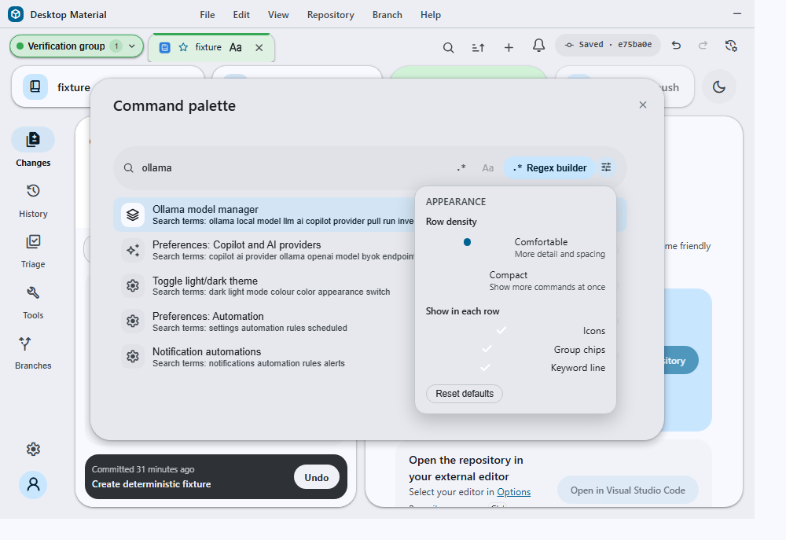

# Command palette rows and appearance

The Ctrl+F command palette lists every named app function. Its result list is
built for scanning: each row carries an icon, the command title, an optional
keyword line, and a group chip, and the reader controls how much of that is
shown.

## Behavior and configuration

The palette is 760px wide (bounded by the viewport) and shows up to 520px of
results, so more commands are visible at once and rich rows have room.

Each row renders:

- a **leading icon** — the command's own Material Symbol when it declares one,
  otherwise its group's icon (Navigate, Repository, Branch, Changes, Edit,
  App), otherwise a neutral fallback so every row keeps the same alignment;
- the **title**, localized when the command declares a translation key;
- a **keyword line** carrying the command's search terms, prefixed as search
  terms in the current language so it explains why a fuzzy match hit and
  doubles as a one-line description;
- a localized **group chip** for Navigate, Repository, Branch, Changes, Edit,
  or App.

**Customize appearance** sits beside the filter-mode and regex controls in the
search pill. It opens an editor anchored to its own button rather than a
separate dialog, so the result list stays visible while it is adjusted and
every change applies immediately:

- **Row density** — comfortable (roomier rows with the secondary line) or
  compact (tighter rows, more commands visible; the keyword line is
  suppressed).
- **Show in each row** — icons, group chips, and the keyword line can each be
  turned off independently.
- **Reset to defaults** restores comfortable density with all three shown.

The choice is stored in `localStorage` under `command-palette-appearance-v1`
and applies to every later palette session.

The palette title, search prompt, empty state, stable group labels, appearance
editor, accessibility names, and the three discoverability entries below all
follow the persisted English, playful Hong Kong-style Cantonese, or bilingual
language mode. Search still folds the English fallback title, raw group, event,
keywords, and localized group label into its secondary keys, so changing
language does not make familiar commands undiscoverable.

## Discoverability entries

Some surfaces are only reachable by knowing which settings tab hosts them, so
the palette names them by what they do rather than where they live:

- **Ollama model manager** and **Preferences: Copilot and AI providers** both
  open the Copilot providers tab, which hosts the Ollama manager.
- **Background action and API queue** opens the queue preferences tab; its
  keywords include `docker`, `api`, and `job` so it is findable by the work it
  manages.

## Failure modes and recovery

Appearance is never load-bearing. A missing, malformed, or partially valid
stored value is repaired field by field against the defaults, and an
unreadable or unwritable `localStorage` is swallowed so the palette always
opens and always runs commands.

Closing the anchored editor with Escape does not also close the palette; the
key is consumed by the editor while it is open and focus returns to the
**Customize appearance** button. Clicking outside closes only the anchored
editor.

## Security considerations

Appearance controls presentation only. It cannot add, hide, reorder, or
re-target a command, and it has no effect on a command's availability
predicate, so a corrupted stored value can never cause a command to dispatch
in a state where it could not otherwise run.

## Verification

`command-palette-appearance-test.ts`, `command-palette-catalog-test.ts`, and
the command-palette surface tests cover storage defaults and repair, icon
resolution precedence, localized discoverability titles, localized group
search, density/toggle persistence, anchored-editor Escape containment, and
focus restoration.
