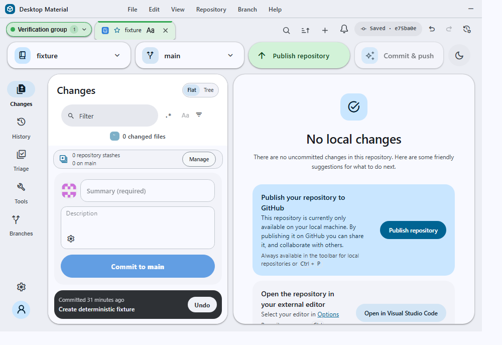

# Tab groups

Repository tabs can be collected into named, colored groups. A group is an
organizational label over the existing strip: it never changes what a tab does,
never closes a tab, and never alters which repository a tab is bound to.
Every non-empty group has a visible chip before its first member, so its name,
color, member count, expanded/collapsed state, and active-group state remain
readable without relying on the members' color bands alone.

## Behavior and configuration

Right-click any tab to reach its group actions:

- **Add tab to new group…** opens a small dialog for the group's name and one
  of six curated colors (blue, green, yellow, red, purple, grey). The
  right-clicked tab becomes the group's first member.
- **Move to “name”** moves the tab into an existing group. The tab is
  repositioned next to that group's last existing member, so a group always
  reads as one contiguous run rather than being split by unrelated tabs. A
  pinned tab cannot join an unpinned group, or vice versa, because no group is
  allowed to cross the strip's protected pin boundary.
- **Remove from “name”** ungroups the tab and leaves it exactly where it sits.
- **Collapse/Expand “name”** toggles the group's real strip state. Collapsing
  hides every member tab but keeps the named group chip visible; clicking the
  chip, or pressing Enter/Space while it is focused, expands the members again.
- **Delete group “name”** removes the label only. Every tab that belonged to
  it stays open and simply becomes ungrouped.

Manual movement preserves membership while a tab stays beside the rest of its
group. Moving it outside that run explicitly ungroups only the moved tab. The
A–Z, opened-time, repository-status, and favorite arrangements treat each
named group as one stable block, using its first member as the block's sort key,
so an unrelated tab can never be sorted into the middle of a group.

A grouped tab shows a colored band along its top edge and a matching tint on
hover and while active. The group chip adds its name, color dot, member count,
chevron, expanded state, and active marker without changing tab geometry,
height, or minimum width. Successful changes announce what happened and return
focus to the chip when a collapse, expansion, or move would otherwise remove
the focused tab from view.

Groups are stored per profile and per window alongside the tabs themselves.
Open, close, bulk-close, session-import, reload, and legacy-primary mirroring
preserve the group array, so names, colors, membership, collapse state, and
unknown forward-compatible fields survive restart, profile/window switching,
and settings-history restore.

All group actions, dialog copy, state announcements, accessible names, color
names, and chip descriptions follow the persisted language mode: English,
playful Hong Kong-style Cantonese, or compact bilingual text. English remains
the fallback for an unknown mode.

## Persistence and compatibility

`IProfileTabsState.groups` and `IRepositoryTab.groupId` are both optional. A
profile written before groups existed loads unchanged and needs no migration
or rewrite. Both the tab and group records retain unknown keys, so a session
written by a newer release and then opened by an older one does not lose
fields it does not understand.

A `groupId` that does not match any declared group is treated as ungrouped
rather than discarded, so a downgrade followed by an upgrade does not silently
strip membership.

Portable **File → Export current tabs…** files intentionally omit group
definitions and each tab's `groupId`. Groups belong to the destination profile,
and exporting membership without its profile-local definition would create a
dangling reference. Import still preserves the current profile's group
definitions while replacing or merging the portable tab list.

## Failure modes and recovery

Creating a group with a blank or whitespace-only name is rejected and the
dialog's confirm action stays disabled. Names are whitespace-collapsed and
truncated to 64 characters on entry.

Moving a tab to a group id that no longer exists ungroups it instead of
leaving a dangling reference. Deleting a group is always non-destructive to
tabs; there is no path from group management to closing a repository tab. A
move that would mix pinned and unpinned members is a safe no-op and does not
write an invalid order. A malformed profile that already mixes pin kinds keeps
the first member's side and safely treats incompatible later members as
ungrouped while compacting valid members into one run.

## Security considerations

Group colors come from a closed, curated set and are re-validated on every
read and render. An untrusted or corrupted persisted color falls back to the
default rather than reaching an inline style, so a hand-edited profile cannot
inject arbitrary CSS through a group. Group names are rendered as text and are
never interpreted as markup.

## Verification

The group contracts are covered across `tab-groups-test.ts`,
`repository-tab-test.ts`, `profile-tabs-file-test.ts`,
`tab-session-file-test.ts`, and the tab-strip surface checks. Coverage includes
curated-color validation, visible/collapsible chips, profile/window persistence,
safe repair of malformed records, pin-boundary rejection, non-destructive
deletion, atomic manual/sorted ordering, portable-export stripping,
localization, focus, and announcements.
